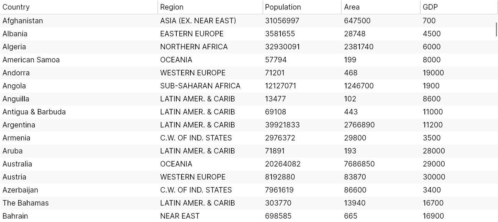

# TreeDataGrid

## Introduction

`TreeDataGrid` is a control for the [Avalonia](https://github.com/AvaloniaUI/Avalonia) UI framework which displays hierarchical and tabular data together in a single view. It is a combination of a `TreeView` and `DataGrid` control.

The control has two modes of operation:

* Hierarchical: data is displayed in a tree with optional columns
* Flat: data is displayed in a 2D table, similar to other `DataGrid` controls

An example of `TreeDataGrid` displaying hierarchical data:


An example of `TreeDataGrid` displaying flat data:



### Current Status

The control is currently in _early beta_. As such there will be bugs, missing features and lacking docs, but the control should be generally usable and performant.


**Note**:

We accept issues and pull requests but we answer and review only pull requests and issues that are created by our customers. It's a quite big project and servicing all issues and pull requests will require more time than we have. But feel free to open issues and pull requests because they may be useful for us!

### Installation

* Add the `Avalonia.Controls.TreeDataGrid` NuGet package to your project
* Add the `TreeDataGrid` theme to your `App.xaml` file (the `StyleInclude` in the following markup):

```markup
<Application xmlns="https://github.com/avaloniaui"
             xmlns:x="http://schemas.microsoft.com/winfx/2006/xaml"
             x:Class="AvaloniaApplication.App">
  <Application.Styles>
    <FluentTheme/>
    <StyleInclude Source="avares://Avalonia.Controls.TreeDataGrid/Themes/Fluent.axaml"/>
  </Application.Styles>
</Application>
```


### **Source repository**

[**Avalonia.Controls.TreeDataGrid**](https://github.com/AvaloniaUI/Avalonia.Controls.TreeDataGrid)

<details>

<summary></summary>


</details>
