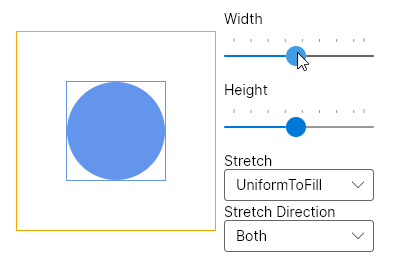
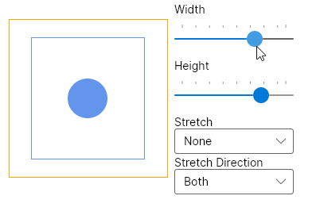
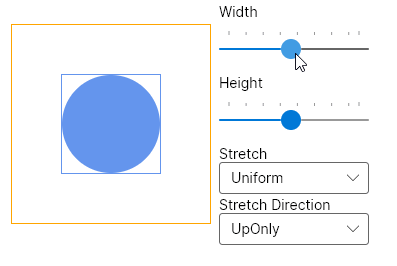
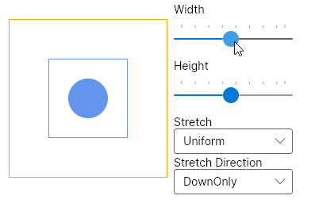

# Viewbox

The `Viewbox` is a decorator control which scales its child. It can be used to scale its child to fit the available space.

The `Viewbox` gives its child infinite space in the measure phase. It will constrain either or both sides when arranging it. This depends on the value of the `Stretch`.

To restrict scaling direction one can use `StretchDirection` which can prevent up or down scaling.



```markup
<!-- Ellipse will occupy 50x50px space -->
<Ellipse Width="50" Height="50" Fill="CornflowerBlue" />  

<!-- Ellipse will be scaled to occupy 300x300px space -->
<Viewbox Stretch="Uniform" Width="300" Height="300">
	<Ellipse Width="50" Height="50" Fill="CornflowerBlue" />  
</Viewbox>
```



```csharp
// Ellipse will occupy 50x50px space
new Ellipse
{
	Width = 50,
	Height = 50,
	Fill = Brushes.CornflowerBlue
};

// Ellipse will be scaled to occupy 300x300px space
new Viewbox
{
	Stretch = Stretch.Uniform,
	Width = 300,
	Height = 300,
	Child = new Ellipse
	{
		Width = 50,
		Height = 50,
		Fill = Brushes.CornflowerBlue
	}
};
```



### Common Properties

| Property | Type | Default | Description |
| :--- | :--- | :--- | :--- |
| `Stretch` | [Stretch](http://reference.avaloniaui.net/api/Avalonia.Media/Stretch) | Uniform | Determines how child fits into the available space |
| `StretchDirection` | [StretchDirection](http://reference.avaloniaui.net/api/Avalonia.Media/StretchDirection) | Both | Determines in what direction child will be scaled |

### Examples

<table>
  <thead>
    <tr>
      <th style="text-align:left"><code>Stretch</code>
      </th>
      <th style="text-align:left"></th>
    </tr>
  </thead>
  <tbody>
    <tr>
      <td style="text-align:left"><code>Uniform</code>
      </td>
      <td style="text-align:left">
        <p></p>
        <p>
          
        </p>
      </td>
    </tr>
    <tr>
      <td style="text-align:left"><code>UniformToFill</code>
      </td>
      <td style="text-align:left">
        <p></p>
        <p>
          
        </p>
      </td>
    </tr>
    <tr>
      <td style="text-align:left"><code>Fill</code>
      </td>
      <td style="text-align:left">
        <p></p>
        <p>
          
        </p>
      </td>
    </tr>
    <tr>
      <td style="text-align:left"><code>None</code>
      </td>
      <td style="text-align:left">
        <p></p>
        <p>
          
        </p>
      </td>
    </tr>
  </tbody>
</table>

<table>
  <thead>
    <tr>
      <th style="text-align:left"><code>StretchDirection</code>
      </th>
      <th style="text-align:left"></th>
    </tr>
  </thead>
  <tbody>
    <tr>
      <td style="text-align:left"><code>Both</code>
      </td>
      <td style="text-align:left">
        
      </td>
    </tr>
    <tr>
      <td style="text-align:left"><code>UpOnly</code>
      </td>
      <td style="text-align:left">
        <p></p>
        <p>
          
        </p>
      </td>
    </tr>
    <tr>
      <td style="text-align:left"><code>DownOnly</code>
      </td>
      <td style="text-align:left">
        <p></p>
        <p>
          
        </p>
      </td>
    </tr>
  </tbody>
</table>

### Pseudoclasses <a id="pseudoclasses"></a>

None

### Reference <a id="reference"></a>

[Viewbox](http://reference.avaloniaui.net/api/Avalonia.Controls/Viewbox/)

### Source code <a id="source-code"></a>

[Viewbox.cs](https://github.com/AvaloniaUI/Avalonia/blob/master/src/Avalonia.Controls/Viewbox.cs)

