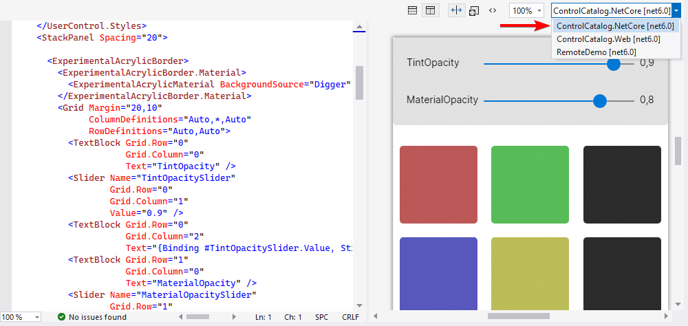

# IDE 支持

## JetBrains Rider <a id="jetbrains-rider"></a>

从 2020.3 开始，[JetBrains Rider](https://www.jetbrains.com/rider/) IDE 内置了对 `Avalonia XAML` 的支持，包括对 `Avalonia` 特定 `XAML` 功能和自定义代码检查的一流支持。

有关更多信息，请参阅 [JetBrains Rider 2020.3 发布公告](https://www.jetbrains.com/rider/whatsnew/2020-3/#version-2020-3-avalonia-support) 。

`Rider` 暂时没有可视化设计器，但功能已经在开发中，有关如何安装的更多信息和说明，请 浏览 [GitHub 项目](https://github.com/ForNeVeR/AvaloniaRider)

## Visual Studio <a id="visual-studio"></a>

### Avalonia Visual Studio 扩展 <a id="avalonia-visual-studio-extension"></a>

[Avalonia for Visual Studio 扩展](https://marketplace.visualstudio.com/items?itemName=AvaloniaTeam.AvaloniaVS) 包括一个 `XAML` 设计器，可用于在编写 `XAML` 时显示它的实时预览。安装了 `Avalonia for Visual Studio` 扩展后，双击 `Avalonia XAML` 文件打开它。 


如果你使用的是 `VS2019` 或 `VS2017` ，则需要安装 [旧版本扩展](https://marketplace.visualstudio.com/items?itemName=AvaloniaTeam.AvaloniaforVisualStudio).


### 用于 Visual Studio 的 ReSharper <a id="resharper-for-visual-studio"></a>

对于 `Visual Studio` 和 `ReSharper` 用户，[ReSharper 2020.3](https://www.jetbrains.com/zh-cn/resharper/whatsnew/2020-3/#version-2020-3-avalonia-support) 内置了代码分析、代码补全、导航和查找用法功能。


如果 `XAML` 已经在库中，`Avalonia` 需要一个可执行的应用程序才能预览它。从设计器右上角的下拉列表中选择可执行项目。项目构建完毕后，在编辑器中编辑 `XAML` 文件会自动更新预览界面。


在某些情况下，由于 `Visual Studio` 中的错误或限制，不是显示`Avalonia XAML` 设计器，而是显示 `WPF` 设计器。如果 `XAML` 文件显示大量错误，请尝试右键单击该文件，然后选择“打开方式…”→ “`Avalonia XAML Editor`”。


## 设计时属性(Design-Time Properties) <a id="design-time-properties"></a>

有许多属性可以应用于控件，这些属性仅在设计时生效。要使用这些，需要在 `XAML` 文件中添加命名空间：

```csharp
xmlns:d="http://schemas.microsoft.com/expression/blend/2008"
```

添加命名空间后，可使用以下设计时属性：

### d:DesignWidth 和 d:DesignHeight <a id="ddesignwidth-and-ddesignheight"></a>

`d:DesignWidth` 和 `d:DesignHeight` 属性可以预览控件的宽度和高度

```markup
<Window xmlns="https://github.com/avaloniaui"
        xmlns:x="http://schemas.microsoft.com/winfx/2006/xaml"
        xmlns:d="http://schemas.microsoft.com/expression/blend/2008"
        d:DesignWidth="800" d:DesignHeight="450"
        x:Class="AvaloniaApplication1.MainWindow">
    Welcome to Avalonia!
</Window>
```

### d:DataContext <a id="ddatacontext"></a>

`d:DataContext` 属性仅仅只在设计时使用 `DataContext` 。建议将此属性与`{x:Static}`指令结合使用，用来引用某个`assembly`中的静态属性。

```markup
<Window xmlns="https://github.com/avaloniaui"
        xmlns:x="http://schemas.microsoft.com/winfx/2006/xaml"
        xmlns:d="http://schemas.microsoft.com/expression/blend/2008"
        xmlns:dd="clr-namespace:My.Namespace;assembly=MyAssembly"
        d:DataContext="{x:Static dd:DesignData.ExampleViewModel}"
        x:Class="AvaloniaApplication1.MainWindow">
    Welcome to Avalonia!
</Window>
```

```csharp
namespace My.Namespace
{
    public static class DesignData
    {
        public static MyViewModel ExampleViewModel { get; } = new MyViewModel
        {
            // View Model initialization here.
        };
    }
}
```

### Design.DataContext <a id="Design.DataContext"></a>

此外你还可以使用依赖属性 `Design.DataContext` 。以及 `Design.Width` 和 `Design.Height`。
```markup
<Window xmlns="https://github.com/avaloniaui"
        xmlns:x="http://schemas.microsoft.com/winfx/2006/xaml"
        xmlns:d="http://schemas.microsoft.com/expression/blend/2008"
        xmlns:dd="clr-namespace:My.Namespace;assembly=MyAssembly"
        x:Class="AvaloniaApplication1.MainWindow"
        Design.Width="100">
    <Design.DataContext>
        <dd:MyViewModel />
    </Design.DataContext>
    Welcome to Avalonia!
</Window>
```

## 诊断错误 <a id="diagnosing-errors"></a>

如果遇到问题，请打开 `verbose` 级别日志：

* 在 `Viual Studio` 的菜单中选择 "工具" → "选项"
* 在列表中选择 `Avalonia XAML Editor`
* 在 `Minimum Log Verbosity` 下选择 `Verbose`

选择“显示输出来源：`Avalonia Diagnostics`”，日志将显示在 `Visual Studio` 输出窗口中。

## 故障排除和常见问题解答

**Visual Studio 不展示 Avalonia 预览器**

有时 `Visual Studio` 会使用 `WPF` 编辑器而不是 `Avalonia` 打开 `XAML` 文件。一般关闭显示错误的文件并重新打开它，问题就能解决。

如果这样做没有效果，可以右键单击该文件并选择`[打开方式…]`。在打开的对话框中，选择`[Avalonia XAML Editor]`。

**我没有预览界面**

如果未正确显示预览界面，请尝试（重新）构建项目或解决方案。预览器需要有效的构建才能正常工作。

此外，如果解决方案中有多个项目，则可能需要选择渲染预览的项目。如下所示：


