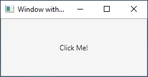

# 用 Avalonia 开发

Avalonia 允许使用[ XAML 标记语言](https://docs.avaloniaui.net/guides/basics/introduction-to-xaml)开发应用程序，使用C\#\（或其他的.NET语言）编码。通常使用 `XAML` 标记来实现应用程序的外观，使用代码来实现其行为。

## 标记(Markup)

`XAML` 是一种基于 `XML` 的标记语言，用声明的方式实现应用程序的外观。通常使用它来创建窗体和用户控件，并用控件、形状和图形来填充。

下面的示例展示了使用 `XAML` 实现包含单个按钮的窗口的外观：

```markup
<Window xmlns="https://github.com/avaloniaui"
        xmlns:x="http://schemas.microsoft.com/winfx/2006/xaml"
        x:Class="AvaloniaApplication1.MainWindow"
        Title="Window with Button"
        Width="250" Height="100">

  <!-- Add button to window -->
  <Button Name="button">Click Me!</Button>

</Window>
```

具体来说，该 `XAML` 分别使用 `window` 和 `button` 元素定义窗体和按钮。每个元素都配置了属性，例如 `Window` 元素的 `Title` 属性，用于指定窗口的标题栏文本。在运行时，`Avalonia` 将标记中定义的元素和属性转换为 `Avalonia` 类的实例。例如，the Window element is converted to an instance of the Window class whose Title property is the value of the Title attribute.

由于 `XAML` 是基于 `XML` 的，因此使用它编写的 UI 是在被称为元素树的嵌套元素层次结构中组装的。元素树能够直观且有逻辑地创建和管理 UI。

下图展示了在 `Windows` 操作系统上运行的上一个示例中 `XAML` 文件定义的用户界面：



## 代码隐藏(Code-behind)

应用程序的主要行为是实现响应用户交互的功能，包括处理事件（例如，单击菜单、工具栏或按钮）以及调用业务逻辑和数据访问逻辑作为响应。

在 Avalonia 中，这种行为可以在与标记相关联的代码中实现。这种类型的代码称为[代码隐藏(code-behind)](https://docs.avaloniaui.net/guides/basics/code-behind)。

下面的示例展示了上一个示例中更新的标记和代码隐藏（请注意，有两个选项卡）：




```markup
<Window xmlns="https://github.com/avaloniaui"
        xmlns:x="http://schemas.microsoft.com/winfx/2006/xaml"
        x:Class="AvaloniaApplication1.MainWindow"
        Title="Window with Button"
        Width="250" Height="100">

  <!-- Add button to window -->
  <Button Name="button" Click="button_Click">Click Me!</Button>

</Window>
```





```csharp
using Avalonia;
using Avalonia.Controls;
using Avalonia.Interactivity;
using Avalonia.Markup.Xaml;

namespace AvaloniaApplication1
{
    public partial class MainWindow : Window
    {
        public MainWindow()
        {
            // Generated with Avalonia.NameGenerator
            InitializeComponent();
        }

        public void button_Click(object sender, RoutedEventArgs e)
        {
            // Change button text when button is clicked.
            var button = (Button)sender;
            button.Content = "Hello, Avalonia!";
        }
    }
}
```





在本例中，代码隐藏实现了一个从[`Window`](https://docs.avaloniaui.net/docs/getting-started/windows)类派生的类。`x:Class` 属性用于将标记与该代码隐藏类相关联。从该代码隐藏类的构造函数中调用 `InitializeComponent` 方法，用于将标记中定义的 UI 与该代码隐藏类合并。
你可能会注意到 `MainWindow` 类被声明为 `partial` ，并且没有发现 `InitializeComponent` 方法的实现。这是因为 `InitializeComponent` 方法主体是由 [Avalonia.NameGenerator](https://github.com/AvaloniaUI/Avalonia.NameGenerator) 包在分部类的对应方自动生成的，默认情况下，这个包包含在 Avalonia 模板中。

`x:Class` 属性和 `InitializeComponent` 方法的组合能够确保在创建实现时正确初始化。代码隐藏类还为按钮的 `Click`（单击）事件实现了一个事件处理程序。单击按钮时，事件处理程序通过在 `button` 控件上设置属性来更改按钮的文本。
