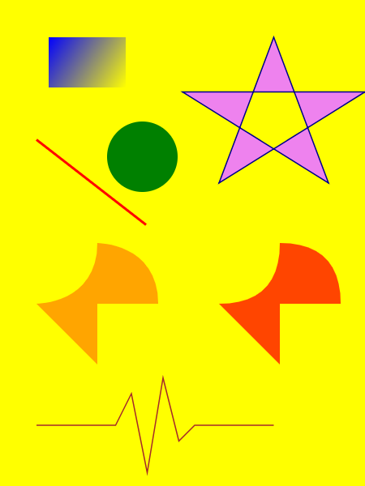

# 图像和动画

## 图像

Avalonia 提供一组广泛、灵活、可扩展的图形功能，具有以下优点：

* 图形与分辨率和设备均无关。Avalonia 图形系统中的基本度量单位是与设备无关的像素（即 1/96 英寸），为实现与分辨率和设备无关的呈现提供了基础。每个与设备无关的像素都会自动缩放，以匹配呈现它的系统的每英寸点数 (dpi) 设置。
* 精度更高。Avalonia 坐标系是用双精度浮点数而非单精度度量的。转换和不透明度值也表示为双精度数字。
* 高级图形和动画支持。Avalonia 通过管理动画场景来简化图形编程；无需担心场景处理、渲染循环和双线性插值。此外，Avalonia 还提供命中判定支持和完整的 alpha 混合支持。
* Skia。Avalonia 默认使用 [Skia](https://skia.org/) 作为渲染引擎。Skia 是为 Google Chrome、Chrome OS、Android、Mozilla Firefox 和 Firefox OS 等产品提供支持的渲染引擎。

## 二维图形和几何图形

Avalonia 提供了一个常见的矢量绘制二维图形库，如 `Ellipse`, `Line`, `Path`, `Polygon` 和 `Rectangle`。

```markup
<Canvas Background="Yellow" Width="300" Height="400">
    <Rectangle Fill="Blue" Width="63" Height="41" Canvas.Left="40" Canvas.Top="31">
        <Rectangle.OpacityMask>
            <LinearGradientBrush StartPoint="0%,0%" EndPoint="100%,100%">
                <LinearGradientBrush.GradientStops>
                    <GradientStop Offset="0" Color="Black"/>
                    <GradientStop Offset="1" Color="Transparent"/>
                </LinearGradientBrush.GradientStops>
            </LinearGradientBrush>
        </Rectangle.OpacityMask>     
    </Rectangle>
    <Ellipse Fill="Green" Width="58" Height="58" Canvas.Left="88" Canvas.Top="100"/>
    <Path Fill="Orange" Data="M 0,0 c 0,0 50,0 50,-50 c 0,0 50,0 50,50 h -50 v 50 l -50,-50 Z" Canvas.Left="30" Canvas.Top="250"/>
    <Path Fill="OrangeRed" Canvas.Left="180" Canvas.Top="250">
        <Path.Data>
            <PathGeometry>
                <PathFigure StartPoint="0,0" IsClosed="True">
                    <QuadraticBezierSegment Point1="50,0" Point2="50,-50" />
                    <QuadraticBezierSegment Point1="100,-50" Point2="100,0" />
                    <LineSegment Point="50,0" />
                    <LineSegment Point="50,50" />
                </PathFigure>
            </PathGeometry>
        </Path.Data>
    </Path>
    <Line StartPoint="120,185" EndPoint="30,115" Stroke="Red" StrokeThickness="2"/>
    <Polygon Points="75,0 120,120 0,45 150,45 30,120" Stroke="DarkBlue" StrokeThickness="1" Fill="Violet" Canvas.Left="150" Canvas.Top="31"/>
    <Polyline Points="0,0 65,0 78,-26 91,39 104,-39 117,13 130,0 195,0" Stroke="Brown" Canvas.Left="30" Canvas.Top="350"/>
</Canvas>
```



## 动画

Avalonia 动画通过支持控件变大、抖动、旋转和淡出等效果，以形成有趣的页面过渡。Avalonia 使用类似 CSS 的动画系统，支持 [属性过渡](../../../docs/animations/transitions) 和 [关键帧动画](../../../docs/animations/keyframe-animations) 。

